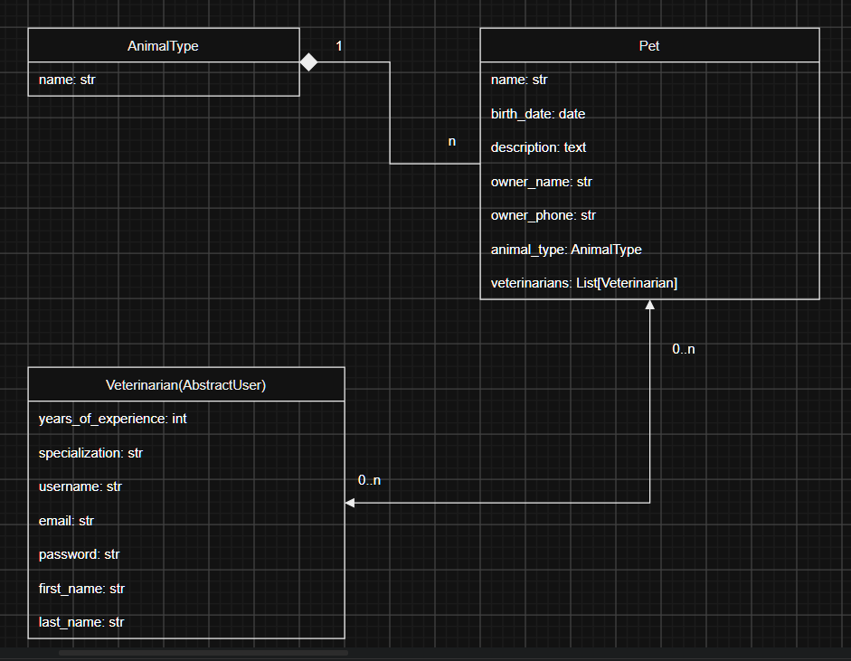

# Vet Clinic

A Django web application for managing a veterinary clinic: veterinarians, their patients (pets), and animal types.

## Features

- User registration with email activation
- Login / logout
- Public list of veterinarians (with pagination)
- Veterinarian detail page and profile editing (login required)
- Pets: list with search by name and animal type, detail page, create, update, delete
- "My patients" page, showing pets assigned to the current veterinarian
- Assign / unassign yourself to a pet with one click
- Create new animal types

## DB Schema:



## Tech Stack

- Python 3.14
- Django 6.1
- SQLite (default database)

## Getting Started

### 1. Clone the repository and activate a virtual environment

### 2. Install dependencies

```bash
pip install -r requirements.txt
```

### 3. Apply migrations

```bash
python manage.py migrate
```

### 4. Load seed data

The repository contains a `seed.json` fixture with demo data (animal types, veterinarians, pets, and a test user).

```bash
python manage.py loaddata seed.json
```

## Demo Credentials

You can log in with the test user loaded from the seed file:

| Username    | Password   |
|-------------|------------|
| `test_user` | `1qazcde3` |

## Project Structure

```
vet-clinic/
├── core/             # Project settings and configuration
├── vet_clinic/       # Main application (models, views, forms, services)
├── templates/        # HTML templates (base, includes, registration, emails, vet_clinic)
├── static/           # Static files
├── seed.json         # Demo data fixture
├── manage.py
└── requirements.txt
```

## Main URLs

| URL                       | Description                    |
|---------------------------|--------------------------------|
| `/`                       | Home page                      |
| `/register/`              | User registration              |
| `/veterinarians/`         | List of veterinarians          |
| `/veterinarians/<id>/`    | Veterinarian details           |
| `/pets/`                  | List of pets (with search)     |
| `/pets/mine/`             | Pets assigned to current user  |
| `/pets/create/`           | Create a pet                   |
| `/pets/<id>/`             | Pet details                    |
| `/animal-types/create/`   | Create an animal type          |
| `/profile/edit`           | Edit your profile              |